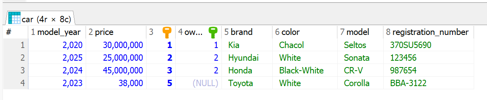

# SpringBoot 복습
Entity의 개념

JPA가 Entity와 어떻게 연결되고 inmememory database인 h2와 어떻게 연결이 되어있는가

Entity 클래스의 경우 DB에서의 테이블 역할. Entity 클래스들의 field들은 column 역할. JPA와 연동되서 필수적으로 기본 생성자 요구. ID 값을 AUTO로 설정해서(=생성될때마다 DB에서 고유 ID값 부여) @AllArgsConstructor 적용시 오류

1. Lombok을 적용하지 않은 경우
```java
package com.example.cardatabase.domain;

import jakarta.persistence.Entity;
import jakarta.persistence.GeneratedValue;
import jakarta.persistence.GenerationType;
import jakarta.persistence.Id;
import lombok.NoArgsConstructor;

@Entity
public class Owner {
    @Id
    @GeneratedValue(strategy = GenerationType.AUTO)
    private Long ownerId;

    private String firstName, lastName;

    // Lombok을 사용하지 않고 기본 생성자 및 ownerId를 제외한 RequiredArgsConstructor를 생성
    // Lombok을 사용하지 않고 각 field에 대한 getter setter 생성

    public Owner() {
    }

    public Owner(String firstName, String lastName) {
        this.firstName = firstName;
        this.lastName = lastName;
    }

    public Long getOwnerId() {
        return ownerId;
    }

    public void setOwnerId(Long ownerId) {
        this.ownerId = ownerId;
    }

    public String getFirstName() {
        return firstName;
    }

    public void setFirstName(String firstName) {
        this.firstName = firstName;
    }

    public String getLastName() {
        return lastName;
    }

    public void setLastName(String lastName) {
        this.lastName = lastName;
    }
}
```

2. Lombok 적용
```java
package com.example.cardatabase.domain;

import jakarta.persistence.Entity;
import jakarta.persistence.GeneratedValue;
import jakarta.persistence.GenerationType;
import jakarta.persistence.Id;
import lombok.*;

@Entity
@Getter
@Setter
@ToString
@NoArgsConstructor(force = true)
@RequiredArgsConstructor
public class Owner {
    @Id
    @GeneratedValue(strategy = GenerationType.AUTO)
    private Long ownerId;

    @NonNull
    private final String firstName;
    @NonNull
    private final String lastName;
}
```
`@NoArgsConstructor(force = true)` : final 필드가 있는 경우에도 해당 필드를 null로 초기화하는 생성자를 강제로 생성해서 `final` 키워드가 가붙은 경우도 JPA에서 요구되는 기본 생성자를 만들 수 있고 `@RequiredArgsConstructor`과 충돌 X

## 테이블 간의 관계 추가
car 테이블과 일대다(1:N) 관계에 있는 owner라는 새 테이블 생성. 일대 다 관계는 소유자가 한 명이 여러대의 자동차를 가질 수 있지만 한 자동차의 소유자는 1명

domain 패키지에는 Owner라는 엔티티 클래스와 OwnerRepository라는 repository 인터페이스를 만들고 OwnerRepository JpaRepository를 상속 받아야 함

이상의 일대다 관계를 추가하려면 `@ManyToOne`과 `@OneToMany` 애너테이션(jakarta.persistence)을 이용. 외래 키를 포함한 Car 엔티티 클래스에서는 `@ManyToOne`을 사용. 그리고 외래키를 추가해서 field 구성 변화

DB적으로 보면 car table에 외래키인 ownerId를 추가하는 개념. 그렇기에 Car entity class에는 Owner 관련 field를 추가해야 하고 getter / setter 역시 요구. 모든 JOIN 관계는 FetchType.LAZY를 사용. 대다(toMany) 관계는 기본값이여서 FetchType을 정의할 필요가 없지만 대일(toOne) 관계는 반드시 명시

FetchType : DB에서 데이터를 검색하는 전략을 정의
- EAGER : 즉시 검색
- LAZY : 지연 검색

얘제에서 지연검색(LAZY)는 DB에서 소유자를 검색하면 해당 소유자와 연관된 모든 자동차를 검색. 즉시검색(EAGER)은 해당 소유자의 모든 자동차를 즉시 검색

```java
// Car.java
package com.example.cardatabase.domain;
import jakarta.persistence.*;
import lombok.Data;
import lombok.NoArgsConstructor;

@NoArgsConstructor
@Data
@Entity
public class Car {
    @Id
    @GeneratedValue(strategy = GenerationType.AUTO)
    private Long id;
    private String brand, model, color, registrationNumber;
    private int modelYear, price;

    @ManyToOne(fetch = FetchType.LAZY)
    @JoinColumn(name = "owner")
    private Owner owner;

    public Owner getOwner() {
        return owner;
    }

    public void setOwner(Owner owner) {
        this.owner = owner;
    }

    public Car(String brand, String model, String color, String registrationNumber, int modelYear, int price) {
        this.brand = brand;
        this.model = model;
        this.color = color;
        this.registrationNumber = registrationNumber;
        this.modelYear = modelYear;
        this.price = price;
    }
}


// Owner.java
package com.example.cardatabase.domain;

import jakarta.persistence.*;
        import lombok.*;

        import java.util.List;

@Entity
@Getter
@Setter
@ToString
@NoArgsConstructor(force = true)
@RequiredArgsConstructor
public class Owner {
    @Id
    @GeneratedValue(strategy = GenerationType.AUTO)
    private Long ownerId;

    @NonNull
    private final String firstName;
    @NonNull
    private final String lastName;

    // 소유자는 다수의 차들을 가질 수 있어서 Collections 사용
    @OneToMany(cascade = CascadeType.ALL, mappedBy = "owner")
    private List<Car> cars;
}
```
이상의 코드에서 `@Data`를 달아둔 경우 겹치지만 Owner과 관련된 getter / setter를 코드로 작성한 반면 `@Getter, @Setter`를 명시한 Owner 클래스는 cars 관련 getter / setter를 작성하지 않음

Owner 클래스의 `@OneToMany` 애너테이션에는 특성 존재
1. cascade 속성은 삭제 / 업데이트 시 연속 효과 적용
- ALL로 설정시 모든 작업 연속 적용
- Owner를 삭제시 그 소유자와 연결된 Car 객체들도 전부 삭제
2. mappedBy="owner" 속성 설정 : Car 클래스 사이에 이 관계의 외래 키인 owner 필드가 존재함을 명시

어색하게 느껴질만한건 ownerId 필드 하나만 가지고 와서 연결짓는게 아니라 Owner 클래스를 통쨰로 들고와서 Car에 field로 삼는다는 점

## H2 -> MariaDB로 이식
-> build.gradle / applications.properties 설정 바꾼다는 뜻

1. HeidiSQL 생성
2. 새 DB 생성 -> cardb 
3. build.gradle에 MariaDB 관련 의존성 추가
    - mvn -> mariadb
```java
dependencies {
	implementation 'org.springframework.boot:spring-boot-starter-web'
	implementation 'org.springframework.boot:spring-boot-starter-data-jpa'
	developmentOnly 'org.springframework.boot:spring-boot-devtools'
//	runtimeOnly 'com.h2database:h2'
	runtimeOnly 'org.mariadb.jdbc:mariadb-java-client'
	testImplementation 'org.springframework.boot:spring-boot-starter-test'

	implementation 'org.projectlombok:lombok:1.18.42'
	annotationProcessor 'org.projectlombok:lombok:1.18.42'
}
```
4. application.properties에 데이터베이스 연결 정의
```properties
spring.application.name=cardatabase
spring.datasource.url=jdbc:mariadb://localhost:3310/cardb
spring.datasource.username=root
spring.datasource.password=1234
spring.datasource.driver-class-name=org.mariadb.jdbc.Driver

spring.jpa.generate-ddl=true
spring.jpa.hibernate.ddl-auto=create-drop
```
`spring.jpa.generate-ddl=true` 설정은 JPA가 데이터베이스를 초기화해야하는지 (true/false) 여부를 정의

`spring.jpa.hibernate.ddl-auto=create-drop` 설정은 데이터베이스 초기화의 작동을 정의. 이용 가능한 값은 none / validate / update / create / create-drop으로 기본값은 db마다 다르고 h2인메모리의 경우 기본적으로 create-drop인데 mariadb는 none
   - create : 애플리케이션이 시작될 때 데이터베이스를 생성하기만 함(그레서 create로 해놓고 동일한 테이블명 설정해두면 오류)
   - update : 데이터베이스를 생성하고 스키마가 변경되면 수정
   - create-drop : 애플리케이션이 시작될때마다 db를 생성하고 중지될때마다 삭제 -> 그래서 잦은 변경사항이 있는 개발 환경에서 난이도 높음

SpringBoot 프로젝트 생성
entity class - repository의 관계성(Lombok 유무에 따른 코드 라인 변경 사항 작성). mariadb 이식 관련 설정

이상까지 작성했다면 CarDatabaseApplication에 CommandLineRunner를 활용한 더미 데이터를 넣기가 번거롭게 느껴지는데 create-drop 때문에 삭제되서 쿼리문을 복사하고 실행할때마다 붙여넣거나 main에 사전 작성 필요

# RESTful API SpringBoot ver.

Spring Data Rest를 이용해 CRUD를 자동으로 제공하는 RESTful 웹서비스를 만들고 그것을 OpenAPI 3(Swagger)로 API 명세서 생성

## REST 기초
- 웹 서비스를 제작하기 위한 아키텍처 스타일. Representational State Transfer를 의미하며 특정 언어나 플랫폼에 독립적이며 앱 / 기타 서비스와 같은 다양한 클라이언트들이서로 통신하게 연결
- 정해진 규칙이 있는 프레임워크라서 이런식으로 작성하라는 의미가 아닌 로이 필딩이라고 하는 개발자가 제시한 제약 조건의 집합
- REST의 제약 조건
   1. 상태 비저장 : 서버는 클라이언트 상태에 관한 어떤 정보도 저장 X
   2. 클라이언트-서버간의 독립성 : 클라이언트와 서버는 독립적으로 작동해야하고 서버는 클라이언트의 요청 없이 어떠한 정보도 전송 X
   3. 캐시 가능 : 여러 클라이언트가 동일한 리소스를 요청하는 경우가 많아 성능 향상을 위해서 리소스에 캐싱 적용
   4. 일관된 인터페이스 : 서로 다른 클라이언트에 대한 요청이더라도 응답은 동일하게 보영야 하며 예시로는 브라우저 / 자바 애플리케이션 / 모바일 앱 등
   5. 계층형 시스템 : 전체 서비스에 영향을 주지 않고 구성 요소를 추가하거나 수정 가능해야 하며 확장성과 관련 있음. EX) 당근 마켓에 지도 추가되거나 채팅 추가 등 기능 추가되도 앱은 정상 작동
   6. 주문형 코드 : 선택 사항에 해당하고 대부분의 서버는 정적 컨텐츠를 JSON 또는 XML 형식으로 전송. 서버의 정적 컨텐츠만이 아닌 실행 코드를 전송하게끔
- REST 아키텍처에 포함되야 하는 요소들
   1. 리소스 식별 : 리소스는 고유 식별자로 식별. REST 리소스는 이해하기 쉬운 디렉토리 구조의 URL을 노출. 그래서 주소를 보면
   2. 표현을 통한 리소스 조작 : 리소스를 요청할 때 서버는 리소스의 표현ㅇ로 응답. 일반적인 표현 형식은 JSON / SML
   3. 자체적인 설명 메세지 : 메세지는 서버가 처리 방법을 알 수있는 충분한 정보 필요
   4. HATEOAS(Hypermedia As The Engine Of Application State) : 응답에는 서비스의 다른 영역으로 연결 링크 포함

## SpringBoot로 RESTful API 웹 서비스 생성
- Controller 클래스 필요. Controller는 모든 HTTP 요청 처리 클래스
- cardatabase 패키지에 web이라는 패키지 생성
- web 패키지 내에 CarController라는 Java class 생성

```java
package com.example.cardatabase.web;

import org.springframework.web.bind.annotation.RestController;

@RestController
public class CarController {
}
```
`@RestController` : 해당 클래스가 RESTful API 웹 서비스 상의 Controller가 될 것을 지정

- 메서드들 포함. Controller 클래스의 메서드에는 메서드가 매핑되는 엔드 포인트가 정의되는 @RequestMapping 애너테이션을 지정. EX) `/cars` 엔트포인트로 GET 요청시 getCars() 메서드 호출

```java
package com.example.cardatabase.web;

import com.example.cardatabase.domain.Car;
import org.springframework.web.bind.annotation.GetMapping;
import org.springframework.web.bind.annotation.RestController;

@RestController
public class CarController {
    @GetMapping("/cars")
    public Iterable<Car> getCars() {
        // 자동차를 검색하고 반환
    }
}
```
이상의 상태에서 getCars() 메서드는 모든 자동차 객체를 반환한 다음 Jackson 라이브러리에 의해서 자동으로 JSON 객체로 반환

그리고 getCars() 메서드는 `@GetMapping` 애너테이션을 이용해서 `/cars` 엔드 포인트의 GET 요청만 처리. 즉 SQL문 상에서 SELECT 요청만 처리. 또한 `@PostMapping`에서 SQL문 상의 INSERT 요청만 처리. `@--Mapping`만 보고서도 어떤 역할을 하는 method인지 추측 가능

`@PostMapping`, `@GetMapping`, `@DeleteMapping` 등이 있고 이러한 POST / GET / DELETE 등을 HTTP 메서드라고 표현

```java
package com.example.cardatabase.web;

import com.example.cardatabase.domain.Car;
import com.example.cardatabase.domain.CarRepository;
import org.springframework.web.bind.annotation.GetMapping;
import org.springframework.web.bind.annotation.RestController;

@RestController
public class CarController {
    private final CarRepository carRepository;

    public CarController(CarRepository carRepository) {
        this.carRepository = carRepository;
    }

    @GetMapping("/cars")
    public Iterable<Car> getCars() {return carRepository.findAll();}
}
```
자동차들이 저장된 곳은 car 테이블이니 SELECT * FROM car;를 호출 할 수 있는 CarRepository가 필요. 그래서 Controller에서 CarRepository를 사용할 수 있게 field로 선언하고 final을 넣어 CarController에 CarRepository가 포함된 매개변수 생성자 생성. 그러면 CarController는 carRepository에 딸린 메서든인 .findAll;를 통해 전체 자동차 목록 return 가능

현재 상황에서 생길 수 있는 문제들
1. 자동차 목록을 가지고 왔는데
2. 자동차 목록의 각 field는 Owner가 포하
3. Owner들에는 cars라는 field 존재
4. 그리고 그 cars List 내에는 각각의 element로 car 객체들 존재
5. 그 car의 객체의 field에는 Owner가 포함
6. 무한 루프

그래서 Owner.java에 `@JsonIgnoreProperties({"hibernateLazyInitializer", "handler"})`와 cars 필드에 `@JsonIgnore`를 적용시 무한 반복 무시 가능

localhost:8080/cars

```java
package com.example.cardatabase.domain;

import com.fasterxml.jackson.annotation.JsonIgnore;
import com.fasterxml.jackson.annotation.JsonIgnoreProperties;
import jakarta.persistence.*;
import lombok.*;

import java.util.List;

@Entity
@JsonIgnoreProperties({"hibernateLazyInitializer", "handler"})
@Getter
@Setter
@ToString
@NoArgsConstructor(force = true)
@RequiredArgsConstructor
public class Owner {
    @Id
    @GeneratedValue(strategy = GenerationType.AUTO)
    private Long ownerId;

    @NonNull
    private final String firstName;
    @NonNull
    private final String lastName;
    
    // 소유자는 다수의 차들을 가질 수 있어서 Collections 사용
    @JsonIgnore
    @OneToMany(cascade = CascadeType.ALL, mappedBy = "owner")
    private List<Car> cars;
}
```

- 참조
  - `@JsonIgnoreProperties({"hibernateLazyInitializer", "handler"})`
  - `@JsonIgnoreProperties(value값)` : JSON 출력 시 지정 속성 무시
  - `@JsonIgnoreProperties({"속성1", "속성2"})` : JSON 출력 시 지정 속성 무시
  - JSON 직렬화 / 역직렬화 과정에서 특정 속성을 무시하게 하는 Jackson 라이브러리 상의 애너테이션에 해당
  - hibernateLazyInitializer
  - handler
    - JPA 프록시 객체에서 발생하는 특수한 필드 중 이상의 두 속성은 JPA가 지연 로딩(Lazy Loading)을 위해 생성하는 내부 필드인데 이것이 JSON에 포함되면 오류가 발생 가능해 default로 제외 시키는 용도
    - 결과적으로 `@JsonIgnoreProperties`는 이상의 두 필드를 제외시키기 위함이고 
    - `@JsonIgnoreProperties`이 field 레벨에서 JSON의 직렬화를 막는 애너테이션

## Spring Data REST 사용
- Spring Data REST는 스프링 데이터 프로젝트의 일부로 스프링으로 RESTful 웹 서비스를 빠르게 구현하게 도와주는 의존성. Spring Data Rest는 클라이언트가 하이퍼 미디어 링크를 이용해 REST API를 동적으로 탐핵하게 하는 아키텍처 원칙 HATEOAS를 지원. 또한 API 엔드포인트의 비즈니스 로직을 사용자 정의에 사용할 수 있는 이벤트 제공

1. build.gradle에 의존성 추가
2. application.properties에서 Spring Data Rest와 관련있는 항목들의 엔드포인트 정의
    - Spring Data REST는 기본적으로 애플리케이션에서 모든 공용 리포지토리를 찾고 엔티티를 위한 RESTful 웹 서비스를 자동 생성. 현재 CarRepository / OwnerRepository 

이상의 부분을 수정하면 localhost:8080/api 엔드포인트로 접속시 RESTful 웹 서비스에 접근 가능. 그리고 내부의 JSON 값들을 보면 전부 특정한 링크로 작성되어있는데 이는 Spring Data Rest가 지원하는 방식으로 JSON 데이터를 HAL(Hypertext Application Language) 형태로 반환. HAL 형식은 하이퍼링크를 JSON으로 표현하는 규칙을 정의해 프론트엔드 개발자가 RESTful 웹 서비스를 더 쉽게 개발 조력

```json
{
  "_links" : {
    "owners" : {
      "href" : "http://localhost:8080/api/owners{?page,size,sort*}",
      "templated" : true
    },
    "cars" : {
      "href" : "http://localhost:8080/api/cars{?page,size,sort*}",
      "templated" : true
    },
    "profile" : {
      "href" : "http://localhost:8080/api/profile"
    }
  }
}
```
이상과 같은 형태의 CarRepository를 탐색해서 1, 2, 3번 차에 대한 정보를 / OwnerRepository를 탐색해 1, 2번 소유주에 관한 정보를 가지고 있는데 Spring Data REST의 서비스 경로의 이름은 Entity 이름에서 파생되어 복수형으로 바뀐 후 소문자로 변경. 자기가 알아서 Car를 보고 cars로 수정해 엔드포인트에 붙인 것

그래서 다른 이름으로 엔드 포인트를 지정하려면 `@RepositoryRestResourece`를 사용하게 되면 변경 가능

```java
import org.springframework.data.jpa.repository.JpaRepository;
import org.springframework.data.rest.core.annotation.RepositoryRestResource;

@RepositoryRestResource(path="vechiels")
public interface CarRepository extends JpaRepository<Car, Long> {
}
```

현재는 /api 엔드포인트로 들어가 table들에 있는 row값들만 볼 수 있지만 /api를 때면 CarController에 딸린 `@GetMapping`만 적용 가능해 차량 목록 조회만 가능

하지만 Spring Data REST를 사용하면 나머지 CRUD와 관련된게 자동 생성되는데 코드라인만 있는게 아니고 실제 읽어서 확인할 수 없기에 Postman이라는 프로그램으로 나머지 POST / GET / DELETE 관련 메서드들을 실행

postman 설치 후 My Collections -> GET New Request -> url : localhost:8080/api/cars

로 현재까지 DB에 들어있는 자동차 목록 출력. 그리고 POST 요청으로 localhost:8080/api/cars를 했을 때 raw / JSON 형식으로 
```json
{
    "brand" : "Toyota",
    "model" : "Corolla",
    "color" : "Silver",
    "registrationNumber" : "BBA-3122",
    "modelYear" : 2023,
    "price" : 38000,
    "owner" : 1
}
```
를 입력하니 201 Created가 뜨며 GET localhost:8080/api/cars를 하니 자동차 한대가 추가된걸 확인 가능하고 HeidiSQL에서 `SELECT * FROM car`의 결과도 확인 가능

즉 Java SpringBoot의 CommandLineRunner를 통해 입력한 더미 데이터와 SQL상으로 Insert문을 입력한 데이터와 postman을 통해 입력한 데이터들을 전부 각각의 장소에서 확인 가능한 점에서 SpringBoot / MariaDB / postman이 서로 연결됨을 알 수 있다

그러면 추가 뿐만 아닌 수정/삭제또한 가능한걸 예측 할 수 있는데 추가한 자동차 데이터가 5번 아이디니

PATCH localhost:8080/api/cars/5
```json
{"color" : "White"}
```
를 하고 PATCH localhost:8080/api/cars/5의 color 값이 변화된걸 조회 가능

POST / PATCH / PUT은 post상에서 headers의 Content-Type 헤더가 application/json으로 설정 필요

- PATCH VS PUT
    1. PATCH : 수정할 부분의 key - value property만 작성할 수 있움
    2. PUT : 수정할 부분이 하나여도 전체 key - value property 작성

그래서 차량 색상을 Silver -> White로 바꿨는데 5번 차량의 Owner가 빈 상태



여기에 owner1을 소유주로 등록

```json
{
    "brand": "Toyota",
    "model": "Corolla",
    "color": "White",
    "registrationNumber": "BBA-3122",
    "modelYear": 2023,
    "price": 38000,
    "_links": {
        "self": {
            "href": "http://localhost:8080/api/cars/5"
        },
        "car": {
            "href": "http://localhost:8080/api/cars/5"
        },
        "owner": {
            "href": "http://localhost:8080/api/cars/5/owner"
        }
    }
}
```
과 같이 나오는데 "_link"의 value인 "owner"의 "href"의 value는 "https://localhost:8080/api/cars/5/owner"이지만 브라우저에서 확인하면 Null값이기에 접근 불가능

이를 PATCH를 통해 수정 가능. 하지만 HATEOAS를 적용시 자동으로 href들이 생성되며 PUT을 통해 5번차량의 소유주를 1번 owner로 지정 가능

1. PUT 요청으로 URL : localhost:8080/api/cars/5/owner
2. 주의사항 : Headers 부분 Content-Type의 value값이 text 혹은 text/plain으로 되어 있어서 이를 해제해고 Content-Type을 추가하고 value로 text/uri-list로 변경
3. 이후 녹색 204 No Content 출력 -> 정상
4. 변경된 사항을 확인 하기 위해 GET localhost:8080/api/cars/5(/owner)를 실행해서 소유주 등록 확인

### 서비스에 쿼리를 추가하는 방식
리포지토리에 대한 쿼리를 작성했었는데 .findByBrand(String brand) 같은 형태. 서비스에 이러한 쿼리를 포함하는것이 가능. 이를 위해 endpoint를 바꿀 때 써먹은 `@RepositoryRestResource` 애너테잇ㄴ 사용 가능. 매개변수에는 `@Param` 지정

```java
@RepositoryRestResource
public interface CarRepository extends JpaRepository<Car, Long> {
    // 브랜드로 자동차 검색하는 쿼리 메서드
    List<Car> findByBrand(@Param("brand") String brand);

    // 색상으로 자동차 검색하는 쿼리 메서드
    List<Car> findByColor(@Param("color") String color);
}
```
로 정의를 하고 postman에서 GET localhost:8080/api/cars로 들어가면 제일 밑 _link에 "search"라는 key 추가 확인

그리고 localhost:8080/api/cars/search로 들어가면 정의한 findByBrand()와 findByColor가 href 형태로 존재하는걸 확인
```json
{
    "_links": {
        "findByBrand": {
            "href": "http://localhost:8080/api/cars/search/findByBrand{?brand}",
            "templated": true
        },
        "findByColor": {
            "href": "http://localhost:8080/api/cars/search/findByColor{?color}",
            "templated": true
        },
        "self": {
            "href": "http://localhost:8080/api/cars/search"
        }
    }
}
```

findByBrand는 http://localhost:8080/api/cars/search/findByBrand?brand=Kia 로 들어가면
```json
{
  "_embedded" : {
    "cars" : [ {
      "brand" : "Kia",
      "model" : "Seltos",
      "color" : "Chacol",
      "registrationNumber" : "370SU5690",
      "modelYear" : 2020,
      "price" : 30000000,
      "_links" : {
        "self" : {
          "href" : "http://localhost:8080/api/cars/1"
        },
        "car" : {
          "href" : "http://localhost:8080/api/cars/1"
        },
        "owner" : {
          "href" : "http://localhost:8080/api/cars/1/owner"
        }
      }
    } ]
  },
  "_links" : {
    "self" : {
      "href" : "http://localhost:8080/api/cars/search/findByBrand?brand=Kia"
    }
  }
}
```