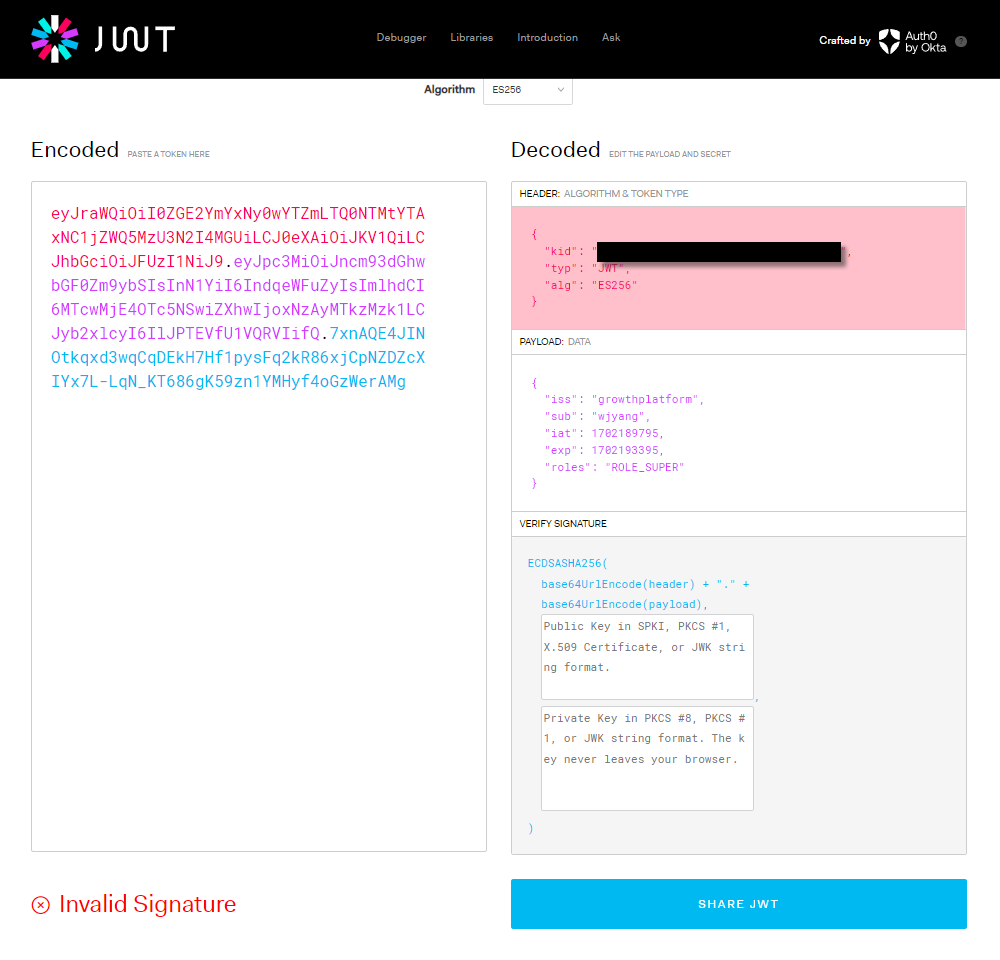

# RESTful API 문서화
- RESTful API는 이를 이용하는 개발자가 그 기능과 작동을 이해할 수 있게 적절히 문서화
- Open API 3를 이용해 이용 가능한 엔드포인트 목록 / 허용 데이터 양식 / API와 상호작용하는 방법 등을 포함

OpenAPI3를 이용한 자동 문서 생성 방식(Swagger 명세)인데 이는 RESTful API를 위한 API 설명 명세서에 해당. RAML도 있으나 한국에서는 잘 사용 안됨

OpenAPI 역시 라이브러리

1. SpringDoc OpenAPI Starter WebMVC UI 사용

`implementation 'org.springdoc:springdoc-openapi-starter-webmvc-ui:2.0.2`

상기해야할 점은 외부 라이브러리를 사용하면 Java 자체를 이용하는게 아니여서 의존성 추가가 선행되어야 함. 의존성 추가는 build.gradle에서 진행

2. com.example.cardatabase 패키지에 OpenApiConfig 클래스 생성
```java
package com.example.cardatabase;

import io.swagger.v3.oas.models.OpenAPI;
import io.swagger.v3.oas.models.info.Info;
import org.springframework.context.annotation.Bean;
import org.springframework.context.annotation.Configuration;

@Configuration
public class OpenApiConfig {

    @Bean
    public OpenAPI carDatabaseOpenApi() {
        return new OpenAPI()
                .info(new Info()
                        .title("Car REST API")
                        .description("My car Stock")
                        .version("1.0")
                );
    }
}
```
이상의 코드에서 `@Bean`이라는 애너테이션이 존재하고 return new OpenApi.info(); 라는 지점에서 chaining method 개념을 도입했고 거기 new Info() 내에서 객체 생성을 빌더 패턴으로 한 사실에 주목

3. application.properties 수정
```properties
spring.application.name=cardatabase
spring.datasource.url=jdbc:mariadb://localhost:3310/cardb
spring.datasource.username=root
spring.datasource.password=1234
spring.datasource.driver-class-name=org.mariadb.jdbc.Driver
spring.jpa.generate-ddl=true
spring.jpa.hibernate.ddl-auto=create-drop
spring.data.rest.basePath=/api
springdoc.swagger-ui.enabled=true
springdoc.swagger-ui.path=/swagger-ui.html
springdoc.api-docs.path=/api-docs
```

이후 http://localhost:8080/swagger-ui/index.html

# Bean / @Bean
- Spring에서 Bean은 스프링 IoC(Inversion of Control : 제어의 역전) 컨테이너가 관리하는 Java 객체

## Bean의 정의
Spring이 등장 전에는 개발자가 직접 new 키워드를 통한 객체 생성을 하고 객체간의 의존성을 관리했었으나 프로젝트가 커질수록 코드가 복잡해지고 유지보수가 힘들어지는 단점이 존재. 예를 들어 A 클래스를 정의하고 B 클래스에서 A 클래스의 객체를 만들었을때 A를 수정하니 B에서 오류 발생 잦음

Spring에서는 이상의 문제를 IoC 개념을 통해서 해결. 개발자가 직접 특정 클래스에서 객체를 생성하는게 아니라 Spring IoC 컨테이너에서 객체 생성 자체를 위임. 스프링 컨테이너는 애플리케이션에서 필요한 객체들을 미리 생성하고 필요할 때 특정 클래스에서 주입. 이렇게 스프링 컨테이너에 의해 관리되는 객체가 Bean

그리고 Bean은 싱글톤 스코프로 관리. 그러면 전체를 통틀어 하나의 객체만 생성되는걸 담보하기에 메모리 효율성을 높이고 일관된 상태 유지 가능

## @Bean 애너테이션
`@Bean` 애너테이션은 메서드에 붙여서 사용하며 이 메서드가 반환하는 객체를 스프링 컨테이너에 빈으로 등록

### @Bean 애너테이션 사용 방법
`@Bean`은 주로 `@Configuration`이 붙은 클래스 내부의 메서드에서 사용. `@Configuration`은 해당 클래스가 빈 설정정보를 가지고 있음을 의미(OpenAPI 도입시 애너테이션 확인)

```java
package com.example.cardatabase;

import io.swagger.v3.oas.models.OpenAPI;
import io.swagger.v3.oas.models.info.Info;
import org.springframework.context.annotation.Bean;
import org.springframework.context.annotation.Configuration;

@Configuration
public class OpenApiConfig {

    @Bean
    public OpenAPI carDatabaseOpenApi() {
        return new OpenAPI()
                .info(new Info()
                        .title("Car REST API")
                        .description("My car Stock")
                        .version("1.0")
                );
    }
}
```

### @Bean의 사용 여부에 따른 코드 라인의 차이
1. @Bean을 사용하지 않을때의 예시
   - @Bean을 사용하지 않으면 개발자가 직접 객체를 생성하고 관리

```java
public class MyService {
    public void doSomething() {
        System.out.println("이 method가 무슨 짓을 하고 있습니다");
    }
}

public class MyController {
    // 개발자가 직접 메서드 호출하기 위한 객체 생성
    private MyService myService1 = new MyService();
    
    public void handleRequest() {
        myService.doSomething();    // MyController 클래스에서 MyService를 만들고 메서드 호출
    }
}
```
그러면 현재로서는 이상한 점은 없지만 이상의 방식은 의존성 주입(Dependency Injection)을 활용하지 않아 객체간의 결합도가 높아지고 테스트 및 유지 보수 어려움. 즉 MyController 클래스만 테스트를 해보려고 해도 내부에서 MyService 객체를 만듼 MyService 클래스까지 무조건 테스트를 해야해서 문제 발생. 개수가 늘어날수록 테스트 양 증가

2. @Bean을 사용하는 예시
- @Bean을 사용하면 스프링 컨테이너가 MyService 클래스의 객체를 생성하고 관리. 그리고 `@Autowired`를 통해 이 객체를 주입받아 사용

```java
import org.assertj.core.util.diff.myers.MyersDiff;
import org.springframework.context.annotation.Bean;
import org.springframework.context.annotation.Configuration;
import org.springframework.stereotype.Controller;

@Configuration
public class AppConfig {
    // MyService 객체를 빈으로 등록 과정
    @Bean
    public MyService myService() {
        return new MySerivce();
    }
}

public class MyService {
    public void doSomething() {
        System.out.println("얘가 뭘 또 합니다");
    }
}

@Controller
public class MyController {
    private final MyService myService;      // 위와의 차이점은 이 클래스에서 객체를 생성하지 않고서 field로 처리했다는 점
    
    // 생성자 주입
    public MyController(MyService myService) {
        this.myService = myService
    }
    
    public void handleRequest() {
        myService.doSomething();
    }
}
```
이상의 예시에서 @Configuration이 붙어있는 AppConfig 클래스는 스프링 빈 구성 클래스로 동작. myService() 메서드에 @Bean 애너테이션을 붙여서 결과값이 MyService의 객체가 되고 이를 스프링 컨테이너에 등록. 이상의 작업이 선행되면 MyController 클래스는 new 키워드 없이 생성자를 통해 바로 스프링 컨테이너로부터 MyService 객체를 전달 받아 사용 가능

그러면 객체가 통째로 하나만 있다는걸 담보할 수 있기에 new를 쓸 때 처럼 객체 개수가 늘어나지 않고 메모리 효율성과 일관성을 가질 수 있으며 MyController - MyService 클래스 간의 결합도를 낮추는 효과

# 백엔드 보호
1. Spring Security
2. JWT를 이용한 백엔드 보호
3. Role-based 보호


## Spring Security
- 자체 기능
  1. 인메모리 사용자 하나를 포함하는 AuthenticationManger 빈. 사용자 이름은 user고 암호는 Console에 실행할때마다 출력
  2. `/css`, `/images` 같은 일반적인 정적 리소스 위치의 경로를 무시. 다른 모든 엔드 포인트에 대한 HTTP 기본 인증
  3. 스프링 ApplicationEventPublisher 인터페이스로 게시되는 보호 이벤트
  4. HSTS, XSS, CSRF를 비롯한 일반적인 저수준 기능을 기본 활성화
  5. 자동 생성되는 기본 로그인 페이지

### Spring Security의 도입
1. build.gradle에 의존성 추가
   - mvn에서
     Spring Boot Starter Security 검색 후 모델 적용(버전 필수 삭제)
```java
implementation 'org.springframework.boot:spring-boot-starter-security'
testImplementation 'org.springframework.boot:spring-boot-starter-security'
```

http://localhost:8080으로 접속시 알아서 http://localhost:8080/login으로 이동하는데 이상의 과정에서 username : user / password : 콘솔 비밀먼호 로 접속하면 http://localhost:8080?continue로 이동

현재는 http://localhost:8080에 입력한게 없어서 whitelabel page가 나오는데 http://localhost:8080/api/cars 등으로 접속하면 데이터가 이전과 같이 나올시 정상 처리

Spring Security 작동 방식을 구성하려면 Config class 추가. 특정 역할이나 사용자가 접근 가능한 URL 또는 URL 패턴을 정의 가능하고 인증 메커니즘, 로그인 프로세스, 세션 관리 등을 정의하는 클래스에 해당

그래서 com.example.cardatabase 패키지에 SecurityConfig 클래스 생성
```java
package com.example.cardatabase;

import org.springframework.context.annotation.Bean;
import org.springframework.context.annotation.Configuration;
import org.springframework.security.config.annotation.web.configuration.EnableWebSecurity;
import org.springframework.security.core.userdetails.User;
import org.springframework.security.core.userdetails.UserDetails;
import org.springframework.security.crypto.bcrypt.BCryptPasswordEncoder;
import org.springframework.security.crypto.password.PasswordEncoder;
import org.springframework.security.provisioning.InMemoryUserDetailsManager;

@Configuration
@EnableWebSecurity
public class SecurityConfig {
    @Bean
    public InMemoryUserDetailsManager userDetailsManager() {
        UserDetails user = User.builder()
                .username("user")
                .password(passwordEncoder().encode("password"))
                .roles("USER")
                .build();
        return new InMemoryUserDetailsManager(user);
    }
    // 암호화를 위한 과정
    @Bean
    public PasswordEncoder passwordEncoder() {
        return new BCryptPasswordEncoder();
    }
}
```
이상의 SecurityConfig의 @Configuration, @EnableWebSecurity 애너테이션은 기본 웹 보호 구성을 해젷며 이 클래스에서 자체 Config를 정의하게 한다 -> 애초에 Spring Security에서 지우나하는 보호 Config 관련 설정들이 있고 커스텀하는 의미

인메모리 사용자를 추가했는게 @Bean을 통해 객체를 스프링 컨테이너에 등록했고 또한 PasswordEncoder 클래스의 객체를 생성해 앞으로 암호 입력을 해도 DB에선 암호화된 상태

이상의 코드 구현에서는 결과적으로 username이 user / 비밀번호가 password(암호화 완료) / 역할은 USER로 정의된 인메모리 사용자 생성(builder pattern으로 생성한것에 주목)

인메모리 사용자를 만는건 개발단계에서는 괜찮으나 운영 환경에서는 사용자 정보를 DB에 저장. 그리고 유저 정보를 DB에 저장하려면 엔티티와 리포지터리 필요. 그리고 암호 역시 일반 텍스트로 DB에 저장하느게 아니라 암호화 과정 요구됨

1. AppUser 생성
```java
package com.example.cardatabase.domain;

import jakarta.persistence.*;
import lombok.Getter;
import lombok.NoArgsConstructor;
import lombok.RequiredArgsConstructor;
import lombok.Setter;

@Entity
@NoArgsConstructor(force = true)
@RequiredArgsConstructor
@Getter
@Setter
public class AppUser {
    @Id
    @GeneratedValue(strategy = GenerationType.AUTO)
    @Column(nullable = false, updatable = false)
    private Long id;

    @Column(nullable = false, unique = true)
    private final String username;

    @Column(nullable = false)
    private final String password;

    @Column(nullable = false)
    private final String role;
}
```
이상의 코드에서 처음으로 @Column 사용을 통한 구체적인 컬럼 설정이 이루어 졌는데 name =  속성으로 컬럼명을 새로 커스텀하는 것부터 nullable로 null 허용 여부 / unique를 통해서 다른 row들과의 차이를 식별할건지 지정 가능

username의 경우 일치하게되면 users들이 서로 다른 사람인걸 인지할 수 어뵤기에 username은 unique 설정을 비밀번호의 경우 인코딩이 되기도 하기에 unique=false로 설정. 특정 컬럼이 어떤 속성을 지니는지는 설계 단계에서 고민

2. AppUserRepository 생성
```java
package com.example.cardatabase.domain;

import org.springframework.data.jpa.repository.JpaRepository;

import java.util.Optional;

public interface AppUserRepository extends JpaRepository<AppUser, Long> {
Optional<AppUser> findByUsername(String username);
}
```
위 코드에서는 여태까지 CarRepository에 추상 메서드들을 정의할 때는 결과값들이 기본적으로 복수로 나오기 때문에 List 자료형을 썻지만 findByUsername()의 경우 username 필드가 unique = true니 결과값이 하나거 0개만 나오니 return type을 list로 설정하는건 적절하지 않은 선택지

그러면 AppUser를 return 하는건 적절하지 않지만 예전에는
```java
public AppUser findByusername(String username) {
    if (username이 DB 내에 일치하는 username이 있다면){
        return 일치 객체
    }
    return null;
}
```
같은 로직이 필요. 하지만 인터페이스니 일반 메서드를 작성하지 못해서 AppUser를 return type으로 작성하면 AppUserRepository를 import 하는 곳 마다 위의 로직을 복사해야 함

그래서 Optional이라는 클래스 출시. null 값으로 return 되더라도 오류 X

3. service 패키지 생성
4. UserDetailsServiceImpl 생성
  - Impl = implement
  - implements의 의미는 특정 인터페이스의 추상 메서드들을 강제 구현하기 위한 명령어
  - 그래서 특정 클래스명이 Impl로 끝나면 어떠한 인터페이스를 구현한 클래스로 해석
  - 인터페이스명Impl.java의 형태로 작성

```java
package com.example.cardatabase.service;

import com.example.cardatabase.domain.AppUser;
import com.example.cardatabase.domain.AppUserRepository;
import org.springframework.security.core.userdetails.User;
import org.springframework.security.core.userdetails.User.UserBuilder;
import org.springframework.security.core.userdetails.UserDetails;
import org.springframework.security.core.userdetails.UserDetailsService;
import org.springframework.security.core.userdetails.UsernameNotFoundException;
import org.springframework.stereotype.Service;

import java.util.Optional;

@Service
public class UserDetailsServiceImpl implements UserDetailsService {
    private final AppUserRepository userRepository;

    public UserDetailsServiceImpl(AppUserRepository userRepository) {
        this.userRepository = userRepository;
    }

    @Override
    public UserDetails loadUserByUsername(String username) throws UsernameNotFoundException {
        Optional<AppUser> user = userRepository.findByUsername(username);

        UserBuilder builder = null;
        if (user.isPresent()) { // 이하의 실행문이 실행되면 user에 AppUser가 있다는 의미
            AppUser currentUser = user.get();
            builder = User.withUsername(username);
            builder.password(currentUser.getPassword());
            builder.roles(currentUser.getRole());
        } else {
            throw new UsernameNotFoundException("User not found.");
        }
        
        return builder.build();
    }
}
```
이상의 코드에서 생기는 의문점은 멀쩡하게 있는 AppUser 클래스의 객체인 user를 그대로 쓰는게 아니라 UserBuilder 라는 다른 클래스의 객체인 builder를 선언하고 내부에 AppUser의 field 값들을 대입하는 로직이 있다는걸 확인 가능

인터페이스 내에는 추상 메서드만 존재하고 이를 구현하는 클래스는 인터페이스 내에 있는 추상 메서드를 강제로 구현(implement)해야만 한다. 이미 AppUser라는 entity 클래스를 만들기 이전에 있는 인터페이스를 구현했기에 거기에 있는 추상 메서드들의 return type은 AppUser가 아니다

또한 다른 개발자들도 이 인터페이슬 구현해야하기에 특정 프로젝트에 맞는 entity 클래스보단 보편적인 return type 요구

그렇게 추상 메서드의 return type이 고정되있어서  만든 entity class의 객체를 UserDetails 클래스의 객체 형태로 대입해줄 필요가 있기에 i문 내부의 실행문에 해당 로직 존재

- 이상의 코드는 Spring Security 인증 처리 시 DB에서 사용자를 가져오기 위해서 UserServiceDetailsImpl 클래스에 AppRepository 클래스를 주입. 그리고 AppUserRepository에는 findByUsername() 메서드를 Optional 결과값이 나오게 작성. 
- 그래서 Optional에 딸린 메서드인 isPresent() 메서드를 통해 특정 username을 지닌 AppUser가 있는지 체크 가능. 그래서 user가 없다면 UsernameNotFoundException 예외를 발생 시켜 투척(throw)
- 강제 구현하도록 된 loadUserByname() 메서드는 인증(authentication)에 필요한 UserDetails 객체를 반환(return type 확인)


SecurityConfig에서 Spring Security가 인메모리 사용자 대신 데이터베이스의 사용자를 이용하게 지정
```java
package com.example.cardatabase;

import org.springframework.context.annotation.Bean;
import org.springframework.context.annotation.Configuration;
import org.springframework.security.config.annotation.web.configuration.EnableWebSecurity;
import org.springframework.security.core.userdetails.User;
import org.springframework.security.core.userdetails.UserDetails;
import org.springframework.security.crypto.bcrypt.BCryptPasswordEncoder;
import org.springframework.security.crypto.password.PasswordEncoder;
import org.springframework.security.provisioning.InMemoryUserDetailsManager;

@Configuration
@EnableWebSecurity
public class SecurityConfig {
    @Bean
    public InMemoryUserDetailsManager userDetailsManager() {
        UserDetails user = User.builder()
                .username("user")
                .password(passwordEncoder().encode("password"))
                .roles("USER")
                .build();
        return new InMemoryUserDetailsManager(user);
    }
    // 암호화를 위한 과정
    @Bean
    public PasswordEncoder passwordEncoder() {
        return new BCryptPasswordEncoder();
    }
    
    // 20250924 1440 UPLOAD
}
```
method를 삭제 후 인메모리 사용자 관련 정보가 전부 삭제되 login 불가능. 이런 경우 SecurityConfig.java 없었을때 콘솔에 비밀번호가 찍이지만 이젠 안 나와 있는데 즉 SecurityConfig 자체가 한국어로 보안구성 관련 클래스이기에 생성하는 순간 Spring Security default 인증이 전부 삭제

수정본
```java
package com.example.cardatabase;

import com.example.cardatabase.service.UserDetailsServiceImpl;
import org.springframework.context.annotation.Bean;
import org.springframework.context.annotation.Configuration;
import org.springframework.security.config.annotation.authentication.builders.AuthenticationManagerBuilder;
import org.springframework.security.config.annotation.web.configuration.EnableWebSecurity;
import org.springframework.security.crypto.bcrypt.BCryptPasswordEncoder;
import org.springframework.security.crypto.password.PasswordEncoder;

@Configuration
@EnableWebSecurity
public class SecurityConfig {
    private final UserDetailsServiceImpl userDetailsService;

    public SecurityConfig(UserDetailsServiceImpl userDetailsService) {
        this.userDetailsService = userDetailsService;
    }

    public void configGlobal (AuthenticationManagerBuilder auth) throws Exception {
        auth.userDetailsService(userDetailsService).passwordEncoder(new BCryptPasswordEncoder());
    }

    @Bean
    public PasswordEncoder passwordEncoder() {
        return new BCryptPasswordEncoder();
    }
}
```
userDetailsService 관련해 method인지 field명인지 객체명인지 구분을 할 필요 존재

CarDatabaseApplication.java에 AppUser 관련 더미데이터를 추가 했는데 주의할 점은 owner 1 / 2를 만들 때 객체명을 따로 짖어 후 만들고 `ownerRepository.save(owner1); / ownerRepository.save(owner2);` 형태로 저장했는데 AppUser에서는 `userRepository.save(new AppUser(username, password, role));` 형태로 저장

- 참고 : bcrypt는 해싱 함수로 암호화에서 자주 사용되는 개념. 해싱된 결과는 항상 달라서 직접 사이트에서 확인 후 결과값을 AppUser() 내부의 argument로 삽입

이상의 과정을 거치고 SpringBoot Project를 재실행 시 HeidiSQL로 app_user의 더미 데이터 확인 가능

또한 http://localhost:8080을 접속하면 자동으로 /login으로 리다이렉팅 되며 id / password를 요구하는데 만든 username / password로 로그인 가능

그런데 postman에서 http://localhost:8080/api/cars를 시도하면 401 Unauthorized 라는 표현 발생


이제 DB에서 접속시 데이터베이스의 사용자를 인증에 이용

GET 요청시 URL에 send만 보내면 그만이지만 인증 절차 작성시 요구사항 존재. POST 욫어시 headers 탭 부분애 Authorization -> Basic Auth -> username / password 사용 후 GET 요청을 날리면 200 OK 출력시 정상

그리고 postman에서 http://localhost:8080/api/appUsers 엔드포인트로 GET 요청을 날리면 회원들의 id / username / hashing된 password 전부 출력

이는 기본적으로 Spring Data REST가 모든 리포지토리에 대해서 RESTful 웹 서비스를 자동으로 생성해서 벌어나는 일. 이를 막기 위해
`@RepositoryRestResource(exported = false)`

```java
package com.example.cardatabase.domain;

import org.springframework.data.jpa.repository.JpaRepository;
import org.springframework.data.rest.core.annotation.RepositoryRestResource;

import java.util.Optional;

@RepositoryRestResource(exported = false)
public interface AppUserRepository extends JpaRepository<AppUser, Long> {
    Optional<AppUser> findByUsername(String username);
}
```

## JWT로 백엔드 보호
- 이전까지의 내용은 basic auth에 해당. 이러한 기본 인증은 토큰을 처리하거나 세션 관리법을 제공하지 않고 그냥 username과 password가 일치하는지만 확인. 그리고 사용자가 로그인할 때 각 요청과 함께 자격 증명이 전송되기 때문에 잠재적 보안 위협이 있는 방식

- 이상의 방법으로는 React 활용 프론트엔드 개발시 사용할 수 없기 때문에 JWT를 활용한 인증 도입

### JWT
- 인증 구현 방식 중 하나로 인증 및 권한 부여 목적으로 RESTful API가 가장 보편적으로 사용되는 방식
- 인증(Authentication) : 보통 로그인 과정과 관련
- 인가/권한 부여(Authorization) : 특저 역할이 특정 페이지를 들어갈 수 있는지 없는지 여부
  - 즉 인증을 받았기 때문에 로그인이 가능했지만 회원이 다른 회원을 삭제할 권한은 없는 반면 관리자는 그 권한을 부여받는 등 인증 이후의 절차
  
- JWT는 크기가 매우 작아서 URL / POST 매개변수 또는 헤더 내부에 담아서 전송 가능

- JWT 내부에 사용자 이름과 역할 등 사용자에 대한 모든 필수 정보 담기 가능

### JWT의 구조
- 기본 구조 : xxxxxxx.yyyyyyy.zzzzzzz
  - xxxxx 부분 : 토큰의 유형과 해싱 알고리즘을 정의하는 헤더(Header)
  - yyyyy 부분 : 페이로드로 인증에서 일반적으로 사용자 정보 포함
  - zzzzz 부분 : 서명으로 토큰이 동중에 변경되지 않았는지 확인에 이용




### JWT 생성 및 해석과 응용 과정
1. Java / Android 용 JWT 라이브러리인 jjwt 라이브러리 의존성을 추가
   - jwt -> JSON Web Token -> JavaScript Object Notation Web Token
   - jjwt -> Java JavaScript Object Notation Web Token
2. 로그인 보호
   1. JWT를 생성하고 검증하는 클래스 생성. service 패키지에서 JwtService 클래스 생성
```java
package com.example.cardatabase.service;

import org.springframework.stereotype.Component;

@Component
public class JwtService {
    // 1일 (밀리초). 실제 운영시에는 더 짧은게 낫다
    static final long EXPIRATIONTIME = 86400000;
    static final String PREFIX = "Bearer";
}
```
만료시간 필드의 경우 1일을 밀리초 단위로 해서 곱한 개념. PREFIX는 토큰의 접두사를 의미하는데 일반적으로 "Bearer" 스키마가 이용되는 편. JWT는 Authorization 헤더로 전송되면서 Bearer 스키마를 이용하는 경우의 예시는 이하로 동일
`Authorization: Bearer <token>`

Bearer 뒤에 공백 존재. 나중에 접두사를 제거하고 token읙 ㅏㅄ만 가지고 유효성을 검증해야해서 Bearer 접두사를 제거하는 과정에서 공백을 제거하지 않는 바람에 결과값이 `<token>`이 아닌 `<token>`이 되서 유혀성 검사에 통과하지 못하는 경우 잦음

   2. jjwt 라이브러의 secretKeyFor() 메서드를 이용해 비밀 키를 생성. 운영 환경상에서는 애플리케이션 구성에서 비밀 키를 읽어오는 등의 차이 존재
      - 이후 getToken() 메서드를 활용해 토큰을 생성하고 return
      - getAuthUser() 메서드를 통해 Authorization 헤더에서 토큰 가져옴
      - jjwt 라이브러리에서 제공하는 parseBuilder() 메서드를 활용, jwtParseBuilder 인스턴스를 생성
      - setSigningKey() 메서드로 토큰 확인을 위한 비밀 키 지정
      - parseClaimsJws() 메서드로 Authorization 헤더에서 Bearer 접두사를 제거
      - getSubject() 메서드로 username을 가져오기
```java
package com.example.cardatabase.service;

import io.jsonwebtoken.Jwts;
import io.jsonwebtoken.SignatureAlgorithm;
import io.jsonwebtoken.security.Keys;
import jakarta.servlet.http.HttpServletRequest;
import org.springframework.http.HttpHeaders;
import org.springframework.stereotype.Component;

import java.security.Key;
import java.util.Date;

@Component
public class JwtService {
    // 1일 (밀리초). 실제 운영시에는 더 짧은게 낫다
    static final long EXPIRATIONTIME = 86400000;
    static final String PREFIX = "Bearer";

    // 비밀 키 생성
    static final Key key = Keys.secretKeyFor(SignatureAlgorithm.HS256);

    // 서명이 이루어진 JWT 토큰을 생성
    public String getToken(String username) {
        String token = Jwts.builder()
                .setSubject(username)
                .setExpiration(new Date(System.currentTimeMillis() + EXPIRATIONTIME))
                .signWith(key)      // 18번 라인의 생성한 비밀키로 서명
                .compact();
        return token;
    }

    // 요청(Request)의 Authorization 헤더에서 토큰을 가져온 뒤 그 토큰 내부를 확인하고 username을 가져오는 부분
    public String getAuthUser(HttpServletRequest request) {
        String token = request.getHeader(   // 이 클래스의 객체가 정확히 뭔지는 모르지만 method 명을 봤을 때 Header가 온다
                                            // 여기 Header는 postman의 Headers에 해당
                HttpHeaders.AUTHORIZATION
        );
        if (token != null) {
            String user = Jwts.parserBuilder()
                    .setSigningKey(key)
                    .build()
                    .parseClaimsJws(token.replace(PREFIX, ""))
                    .getBody()
                    .getSubject();

            if (user != null) {
                return user;
            }
        }
        return null;
    }
}
```
이상의 코드 쓰는것에서 생겨난 문제점들

build.gradle에서의 jjwt 관련 version 불일치로 인해서 parseBuilder() 메서드가 더 이상 지원하지 않는 다는 문제점이 있어서 0.11.5로 수정
```java
dependencies {
	implementation 'org.springframework.boot:spring-boot-starter-web'
	implementation 'org.springframework.boot:spring-boot-starter-data-jpa'
	// Spring Data Rest 의존성 추가 영역
	implementation 'org.springframework.boot:spring-boot-starter-data-rest'
	developmentOnly 'org.springframework.boot:spring-boot-devtools'
	// runtimeOnly 'com.h2database:h2'
	runtimeOnly 'org.mariadb.jdbc:mariadb-java-client'
	testImplementation 'org.springframework.boot:spring-boot-starter-test'

	implementation 'org.projectlombok:lombok:1.18.42'
	annotationProcessor 'org.projectlombok:lombok:1.18.42'

	// OpenAPI 명세서 관련 의존성
	implementation 'org.springdoc:springdoc-openapi-starter-webmvc-ui:2.0.2'

	// Spring Security 관련 의존성
	implementation 'org.springframework.boot:spring-boot-starter-security'
	testImplementation 'org.springframework.boot:spring-boot-starter-security'

	// jjwt 관련 설정
	implementation 'io.jsonwebtoken:jjwt-api:0.11.5'
	runtimeOnly 'io.jsonwebtoken:jjwt-impl:0.11.5'
	runtimeOnly 'io.jsonwebtoken:jjwt-jackson:0.11.5'
}
```
버전 불일치로 인한 코드 작성 방식의 변경은 빈번히 일어나는 편. 그러나 최신 버전이 LTS로 넘어가지 전까지는 사용하지 않는 편 권장

이러한 코드는 getToken()을 통해 토큰을 생성하는 메서드와 getAuthUser() 메서드를 통해 토큰을 확인해 서명된 user를 return하게 정의